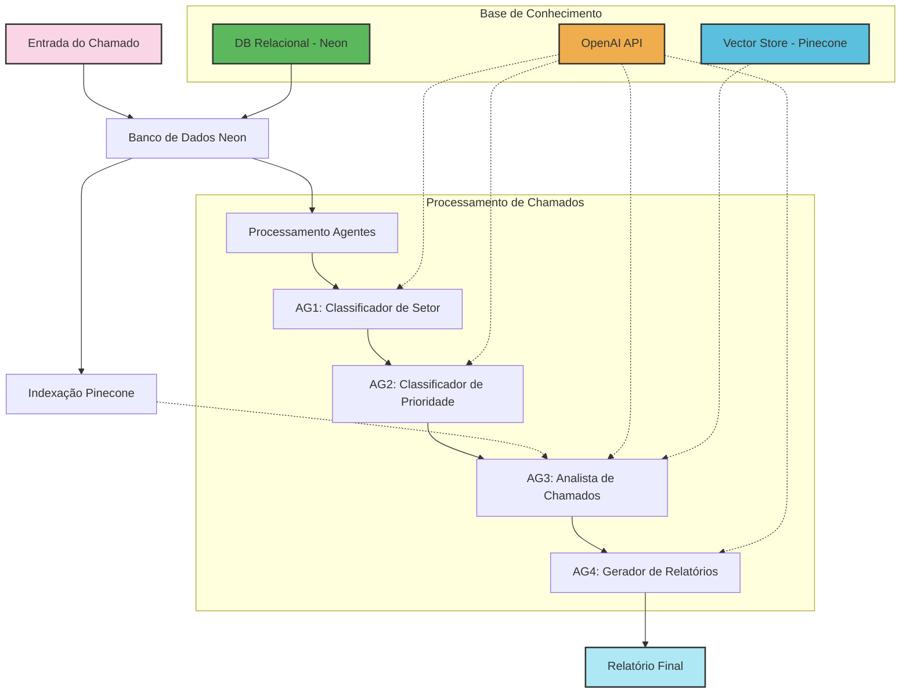

## Explicação do Fluxo de Processamento

1. **Entrada do Chamado**: Um novo ticket de suporte é registrado no sistema.

2. **Banco de Dados Neon**: Os dados do chamado são armazenados no banco PostgreSQL da Neon.

3. **Indexação Pinecone**: Paralelamente, o conteúdo textual do chamado é convertido em embeddings e indexado no Pinecone para pesquisas semânticas.

4. **Processamento por Agentes**:
   - **AG1 (Classificador de Setor)**: Analisa o conteúdo do chamado e determina a qual setor ele pertence (TI, Financeiro, RH, etc.).
   - **AG2 (Classificador de Prioridade)**: Determina a urgência e prioridade do chamado.
   - **AG3 (Analista de Chamados)**: Analisa o conteúdo completo, podendo consultar a base vetorial no Pinecone para encontrar casos similares.
   - **AG4 (Gerador de Relatórios)**: Compila todas as informações e gera um relatório final.

5. **Relatório Final**: Documento com a análise completa e recomendações é gerado e disponibilizado.

O diagrama também mostra as interações com:
- **OpenAI API**: Fornece os modelos de IA para todos os agentes.
- **Vector Store (Pinecone)**: Armazena embeddings para consulta semântica.
- **DB Relacional (Neon)**: Armazena todos os dados estruturados dos chamados.
